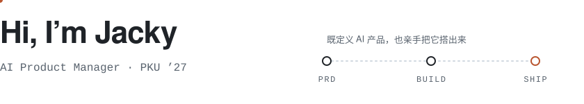
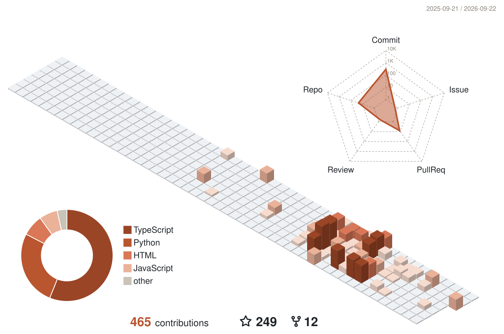

<picture>
  <source media="(prefers-color-scheme: dark)" srcset="assets/hero-dark.svg">
  
</picture>

- 🎯 专注 **AI 产品 / AI Agent**，从需求到能跑的产品，商业化闭环
- 📈 也做过 **投资分析**，目前在 **真格基金**
- 📫 [chenkeyu12@stu.pku.edu.cn](mailto:chenkeyu12@stu.pku.edu.cn) · [aisearches.cc](https://aisearches.cc/)

### Shipped

| | Project | 一句话 | |
|:-:|---|---|:-:|
| `01` | [**AI-Search**](https://github.com/Jackychen-12/AI-Search) | 每日自动聚合 25+ 源的 AI 资讯站，零成本 · [live](https://aisearches.cc/) |  |
| `02` | [**wechat-digest-skill**](https://github.com/Jackychen-12/wechat-digest-skill) | 公众号采集 → 知识库 → 离线 HTML 工作台 |  |
| `03` | [**life-designer**](https://github.com/Jackychen-12/life-designer) | 基于斯坦福 Life Design Lab 的 AI 人生设计师 |  |
| `04` | [**WealthPilot**](https://github.com/Jackychen-12/wealthpilot) | AI 投顾 Agent：持仓分析 + 风险洞察 |  |
| `05` | [**Career-Search**](https://github.com/Jackychen-12/Career-Search) | AI 求职助手：岗位聚合 + 画像匹配 + 投递追踪 |  |
| `06` | [**knowledge-output-wiki**](https://github.com/Jackychen-12/knowledge-output-wiki) | 双层个人 wiki 技能：长期知识层 + 场景化输出层 |  |

more

[Little Bell](https://github.com/Jackychen-12/little-bell) · [城脉 LU](https://github.com/Jackychen-12/Hackathon-for-Meituan) · [Emotional Companion](https://github.com/Jackychen-12/Emotional-Companion-Agent) · [墨摘](https://github.com/Jackychen-12/wechat-digest) · [Token-Park-Agent](https://github.com/Jackychen-12/Token-Park-Agent) · [zh-quality](https://github.com/Jackychen-12/zh-quality)

